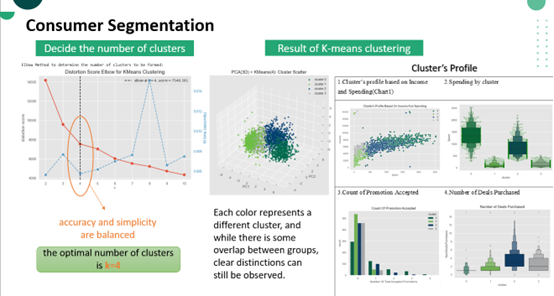
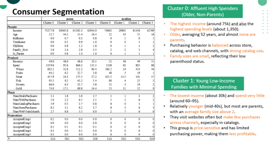
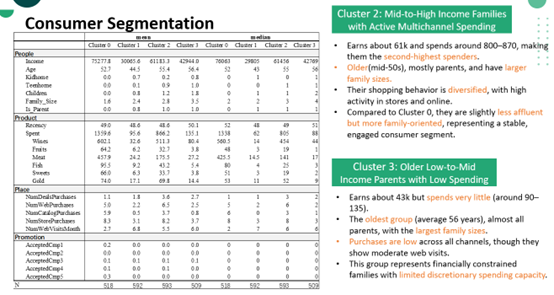

# E-commerce-Marketing-Optimization-Project
This project analyzes a marketing campaign dataset of approximately 2,000 customers to identify factors influencing spending and promotional response.

# Using K-means clustering, four distinct customer segments were identified:
1.	Affluent Non-Parent High-Value Buyers
2.	Budget-Constrained Young Families
3.	Omni-Channel Quality Lifestyle Families
4.	Budget-Conscious Large Elderly Families

Regression and machine learning models (Linear, Logistic, Random Forest) revealed that income, recency, and spending are key drivers of response behavior.
Based on these findings, the team proposed targeted promotion strategies per cluster to improve campaign ROI.
The project demonstrates how data analytics can transform raw customer data into actionable business insights.

# The key conclusions from the analysis are as follows:
* Marketing cannot be one-size-fits-all because the customer base is fundamentally segmented by a combination of wealth, life stage, and channel preference.
* Promotions naturally attract the already valuable as high-income, high-spending customers (Cluster 0) are the most likely to respond, indicating a reinforcing cycle.
* Activity and loyalty are key since recent engagement and long tenure are consistently top predictors of response, overshadowing many demographic details.
* The store channel is a weak promotional lever as customers who prefer it are inherently less likely to accept promotions, making online and catalog channels more efficient.
* Spending is triggered by different factors for each segment; successful campaigns must align with each cluster's unique motivations, from luxury seeking to discount hunting.
